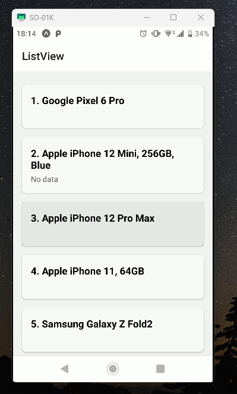
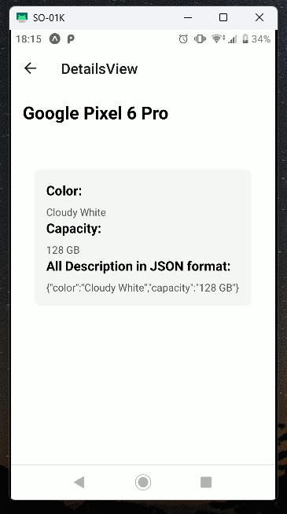
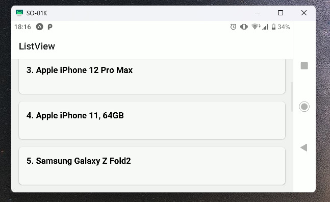
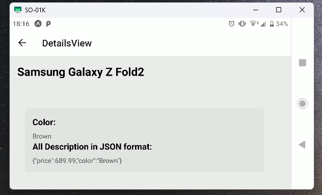
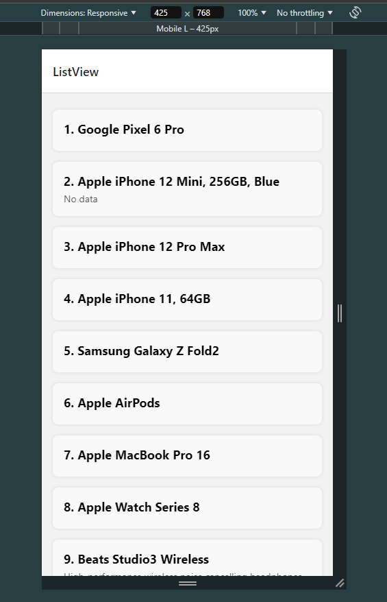
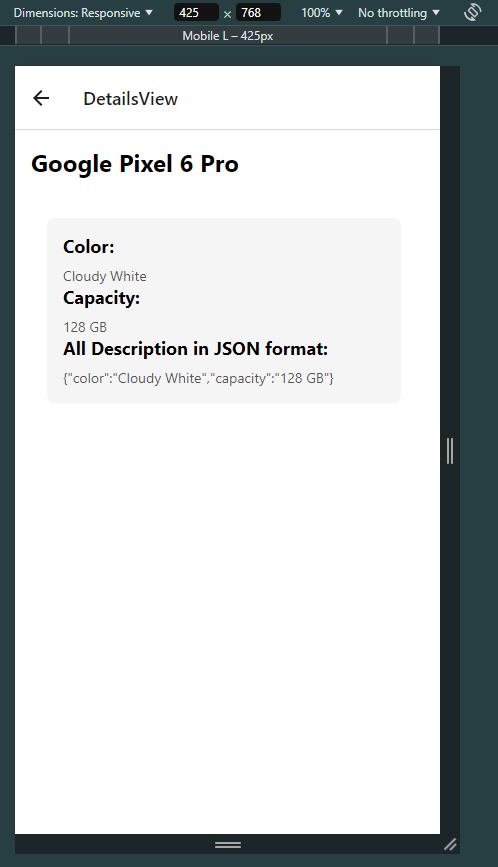
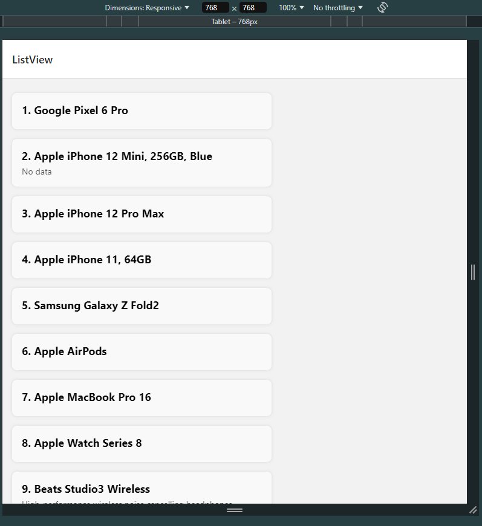
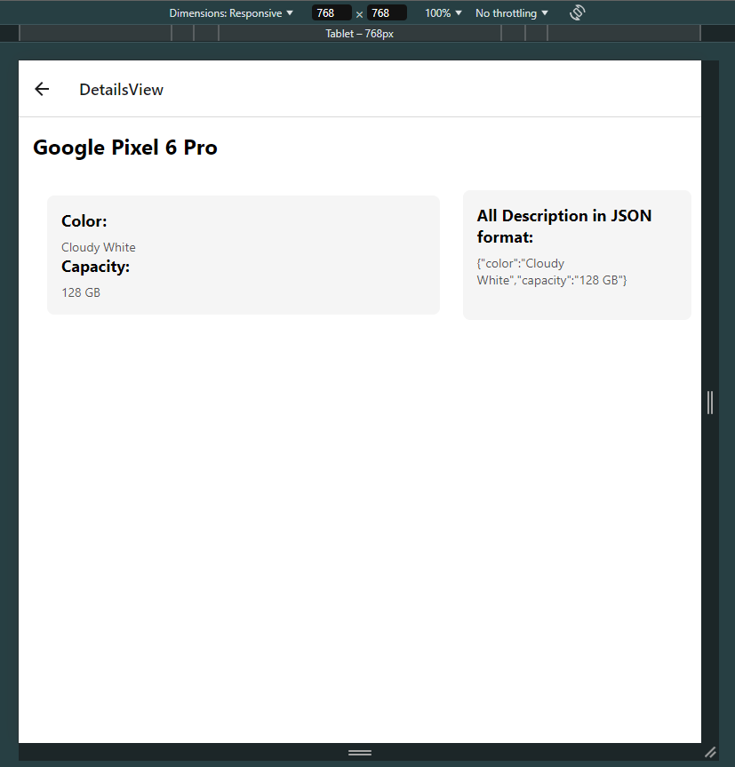

## Mobile App: ListView and DetailsView [React Native App]

### Contents
- [Screens](#screens)
    - [ListView](#listview)
    - [DetailsView](#detailsview)
- [Libraries](#libraries)
- [Dimensions](#dimensions)
- [Running App Screenshots](#running app screenshots)

### Screens
This is a React Native App with two screens:
- ListView
- DetailsView

#### ListView
This screen is connecting to a remote API server: [https://api.restful-api.dev/objects](https://api.restful-api.dev/objects) that is providing testing JSON data with unique id for each.

#### DetailsView
This screen is being used to display a single data object using the unique id identifying it.

### Libraries
All libraries used in this project are found in `package.json` file.
Here are some:
  - [@react-navigation]('https://reactnavigation.org/): provide routing and navigation of screens in the app
  - [axios]('https://axios-http.com/docs/intro'): is being used to handle http request including getting data from API
  - [react-native-web](https://www.npmjs.com/package/react-native-web): is used to run React Native app in web browser. This helped us test different dimensions of our app.
  - [react-native](https://www.npmjs.com/package/react-native): contains basic UI components like View, Text, Touchable, etc.

### Dimensions
With the help of `Dimension` from `react-native` library, we can get the width and height of current device where our app is running on.
The `isTableDevice.js` file used this dimensions to know if the current device is **Tablet** or not. By this, we can make styles for different screen based
on different devices.

### Running App Screenshots

#### In Android
- ListView
  -  
- DetailsView 
  - 

- Landscape - ListView
  -  
- Landscape - DetailsView
  - 

#### In Web
- ListView - Mobile L Dimensions
  -  
- DetailsView - Mobile L Dimensions
  - 
  - 
- ListView - Tablet Dimensions
  - 
- DetailsView - Tablet Dimensions
  - 